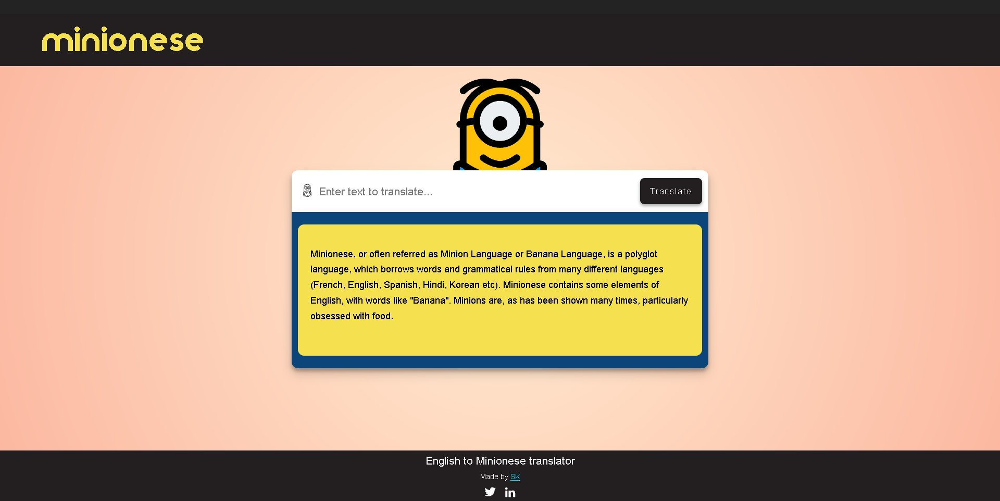

# English to Minionese Translator App

Minionese app is built using vanilla JavaScript. User can type in text in English and convert it to Minionese. Minionese, or often referred as Minion Language or Banana Language, is a polyglot language, which borrows words and grammatical rules from many different languages (French, English, Spanish, Hindi, Korean etc). Also implemented minion eye animation using css. It currently uses the funtranslations Minion api and is rate limited to 5/hour.

Hosted on Netlify.

## Installation

Clone the repository or download it as zip.

## Demo

Online demo available at [minionese](https://minionese.netlify.app/).
